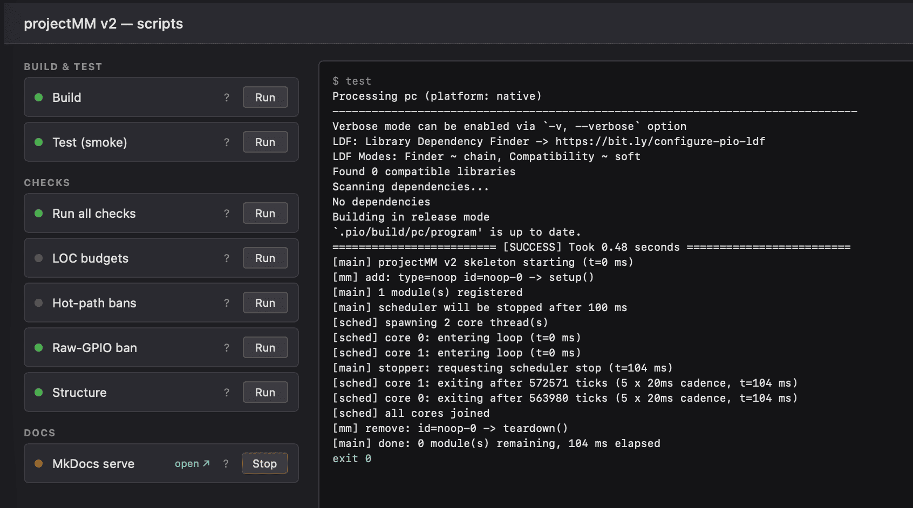

# Deploy

Build, flash, and test on PC (and ESP32 from Sprint 3). The deploy pipeline target is three scripts: `build`, `flash`, `test`. Anything beyond that requires a structural-additions justification under the guardrails — see [process architecture](architecture/process.md).

## Interactive: the script UI {#interactive}

```bash
uv run scripts/ui.py        # prints http://127.0.0.1:8765 — open it in your browser
```



A small local page lists every script grouped by purpose. Click **Run** to execute one; stdout and stderr stream live to the output panel; the card's status dot turns green on exit 0, red otherwise. "Run all checks" runs all six guardrail checks in sequence and stops at the first failure.

Long-running scripts (currently: **MkDocs serve**) have **Start** / **Stop** instead of Run, plus a clickable link to their served URL while running. The UI reflects state across page reloads via `/status`, so reopening the tab shows what's already running and lets you stop it from any session. Children are killed via process group, so the full `uv run mkdocs serve` → mkdocs chain shuts down cleanly.

The UI is the developer's window into the project's processes — what scripts exist, what they do, what they output. It is the only place where script results render side-by-side.

## Non-interactive: direct invocation

Pre-commit, CI, and ad-hoc command-line use call scripts directly:

```bash
uv run scripts/build.py
uv run scripts/test.py
uv run scripts/check_loc.py
```

## Enable the pre-commit hook

```bash
git config core.hooksPath .githooks
```

The hook runs all six `check_*.py` scripts against the working tree before every commit. Same scripts CI runs. Requires [uv](https://docs.astral.sh/uv/) on PATH.

## Scripts

Every card in the UI has a `?` link that jumps to the matching section below.

### Build {#build}

Runs PlatformIO against `env:pc`: `pio run -e pc`. Produces `.pio/build/pc/program`; no-op if the binary is up to date. Source: `scripts/build.py`.

The same script accepts an env name as its first positional argument, which the **Build esp32dev** and **Build esp32s3_n16r8** cards pass to invoke `pio run -e esp32dev` / `pio run -e esp32s3_n16r8`. CI runs the same script three times via a matrix; pre-commit only builds PC.

### Test {#test}

Runs the host unit and integration test suite via `pio test -e pc-test`. Uses [doctest](https://github.com/doctest/doctest) (fetched automatically by PlatformIO). Covers `ModuleManager` factory, `HelloModule` counter, and `HttpServerModule` REST handlers via direct dispatch (no sockets). Source: `scripts/test.py`.

### Run {#run}

Starts the compiled `pc` binary (long-running). Exposes the browser UI and REST API on `http://127.0.0.1:8080`. Start the Run card after a successful Build; Stop sends SIGTERM. Source: `scripts/run.py`.

### Flash esp32dev / Flash esp32s3_n16r8 {#flash-esp32dev}

Uploads the built firmware over USB via `pio run -e <env> --target upload --upload-port <port>`. Uses the port selected in the header port picker — disabled if none is selected. Source: `scripts/flash.py`. CI does not flash (no hardware in the runner).

### Serial monitor (esp32dev / esp32s3_n16r8) {#monitor-esp32dev}

Long-running. Wraps `pio device monitor -e <env> --port <port>`, which reads `monitor_speed` (115200) and `monitor_filters` (`esp32_exception_decoder` — decodes panic backtraces inline) from the env section in `platformio.ini`. Stop sends SIGTERM. The serial port is exclusive, so stop the monitor before flashing the same device. Source: `scripts/monitor.py`.

### USB serial port picker

Header dropdown listing currently-attached devices (`/dev/cu.usb*` on macOS, `/dev/ttyUSB*` / `/dev/ttyACM*` on Linux). Each entry is annotated with the connected board family — `ESP32 (CP210x)`, `ESP32 (CH340)`, `ESP32-S2/S3 (USB-CDC)`, etc. — derived from the USB VID/PID via [`pyserial`](https://pythonhosted.org/pyserial/)'s `serial.tools.list_ports` (a project dep). Unrecognised devices fall back to their pyserial `product` string (e.g. `LG Monitor Controls` — useful for telling them apart from the ESP32s in the list). The **↻** button rescans; selection persists across page reloads via `localStorage`. The Flash and Serial monitor cards consume the current selection — their buttons disable when nothing is selected. Source: `scan_ports()` in `scripts/ui.py`.

### Run all checks {#all-checks}

Runs all `check_*` scripts (LOC budgets, hot-path bans, raw-GPIO ban, structure, platform guards) in sequence and stops at the first failure. Same set the pre-commit hook runs.

### LOC budgets {#check-loc}

Counts non-blank lines in each surface and compares against the budget:

| Surface | Budget | Notes |
|---|---|---|
| `src/core/` | 300 | ModuleManager + Scheduler only; excludes nested `MoonModule.{h,cpp}` |
| `src/core/MoonModule.h` | 250 | the contract: lifecycle + controls + identity (Sprint 3 port) |
| `src/core/MoonModule.cpp` | 350 | non-trivial method implementations (Sprint 3 port) |
| `src/pal/Pal.h` | 100 | timing: millis, micros, yield, sleep |
| `src/pal/PalHttp.h` | 350 | HTTP server (cpp-httplib on PC, ESPAsyncWebServer on ESP32) |
| `src/pal/PalWs.h` | 450 | WebSocket (POSIX sockets on PC, AsyncWebSocket on ESP32) |
| `src/pal/PalSystemInfo.h` | 250 | chip_model, reset_reason_str, build info (bumped 200→250 in Sprint 4 when the ESP32 branch landed) |
| `src/modules/network/` | 250 | Module wrappers only: `HttpServerModule` + `WebSocketModule` |
| `src/modules/system/` | 300 | SystemStatusModule (Sprint 3) + future NTP/WiFi modules |

Pal files for `PalFs`, `PalGpio`, `PalRtos`, and `PalHeap` are intentionally **not** pre-registered — each lands with its first consumer (Sprint 5 for WiFi credentials; Sprint 6 for the light driver and FreeRTOS task pin). Pre-registering a budget for a file that has no caller is the v1 kitchen-sink pattern this list exists to prevent.

`src/frontend/` (the SPA bundle) is not counted — it is generated data (gzipped JS/CSS as a `uint8_t` array). Authored UI sources (`index.html`, `style.css`, `app.js`) are `.html` / `.css` / `.js` so check_loc skips them too.

`src/pal/` files must each have a BUDGETS entry; `check_loc.py` fails on any unbudgeted pal file. Adding a new pal concern is therefore an explicit decision: pick a budget, write a one-line comment in `BUDGETS` saying what the file is for. This is what keeps the `pal/` directory partitioned by concern instead of becoming v1's kitchen-sink Pal.h.

Surfaces are nested-aware: counting `src/core/` excludes anything that falls under another budgeted sub-path. Fails if any surface exceeds its budget. Bumping a budget requires editing `scripts/check_loc.py` with a signed-off line in the release plan.

### Hot-path bans {#check-hot-path}

Scans `src/` for `void <Class>::loop[20ms|1s|10s]?() { ... }` method bodies and fails if any contains a banned pattern:

- Allocations — `new` / `malloc` / `psram_malloc` / `JsonDocument`
- Blocking calls — `delay` / `vTaskDelay` / `sleep` / `usleep` / `recv`

Implements the hot-path rules from [process architecture](architecture/process.md): no allocations and no blocking calls inside any `loop*()` body. Allocate in `setup()` or on a control-update event instead. Source: `scripts/check_hot_path.py`.

### Raw-GPIO ban {#check-gpio}

Fails on any GPIO call with a literal integer pin: `pinMode(5, ...)`, `digitalWrite(13, ...)`, `gpio_set_level(2, ...)`, `analogRead(34)`, and similar. Pins must come from a typed board configuration (e.g. `BoardPins::WS2812_DATA`) — the rule is about traceability of the pin number, not whether it is statically known. Source: `scripts/check_gpio.py`.

### Structure {#check-structure}

Lists tracked top-level paths (`git ls-files`) and fails on anything not in the allowlist hard-coded in `scripts/check_structure.py`. Adding a new top-level path requires editing the allowlist with a paired ADR under `docs/adr/`.

### Platform guards {#check-platform}

Scans every `.h` / `.hpp` / `.cpp` / `.cc` file under `src/` **except** files in `src/pal/`, and fails on any platform-identity gate: `#ifdef ARDUINO`, `#ifdef ESP_PLATFORM`, `#ifdef ESP32`, `#ifdef ARDUINO_ARCH_*`, `#include <Arduino.h>`, `#include <esp_*.h>`, `#include <freertos/...>`. Platform-conditional code lives only in `src/pal/` files; modules consume it through the `pal::*` interface. See [system architecture — Pal](architecture/system.md#pal--the-only-place-platform-conditionals-appear). Source: `scripts/check_platform_guards.py`.

### Frontend bundle drift {#check-bundle}

Re-generates `src/frontend/frontend_bundle.h` in-memory from the sources (`index.html` + `style.css` + `app.js`) and fails if the committed bundle differs byte-for-byte. The generator (`scripts/gen_frontend_bundle.py`) is deterministic — `gzip` is invoked with `mtime=0` so identical sources always produce identical bundles. Fix drift by running `uv run scripts/gen_frontend_bundle.py` and committing the regenerated bundle. Source: `scripts/check_bundle.py`.

### Regenerate frontend bundle {#gen-bundle}

Inlines `style.css` and `app.js` into `index.html`, gzip-compresses the result, and writes `src/frontend/frontend_bundle.h` as a `uint8_t` array. `HttpServerModule` serves this on `GET /` with `Content-Encoding: gzip`. Source: `scripts/gen_frontend_bundle.py`.

### MkDocs serve {#mkdocs}

Starts the local documentation server at `http://127.0.0.1:8000/projectMM-v2/` via `uv run --extra docs mkdocs serve --dev-addr 127.0.0.1:8000`. Long-running: the card shows **Start** / **Stop**, plus a clickable "open ↗" link while running. Source: `scripts/mkdocs_serve.py`.
