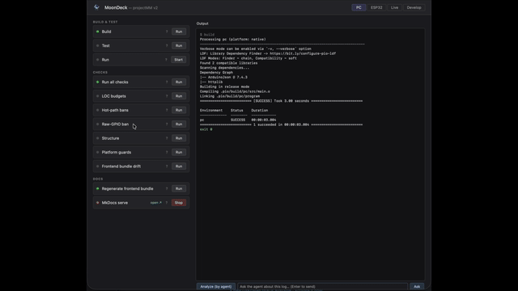

# Deploy

Build, flash, and test on PC (and ESP32 from Sprint 3). The deploy pipeline target is three scripts: `build`, `flash`, `test`. Anything beyond that requires a structural-additions justification under the guardrails — see [process architecture](../architecture/process.md).

The primary interactive surface is **MoonDeck** (`scripts/moondeck.py`) — a local browser console that renders every script below as a clickable card grouped into four tabs, with live output streaming, device discovery, in-process and live scenario runners, and an agent loop (Analyze / Fix / Ask). The same scripts can also be invoked directly from the shell, which is what CI and the pre-commit hook do.

## MoonDeck — interactive dev console {#moondeck}

```bash
uv run scripts/moondeck.py        # prints http://127.0.0.1:8765 — open it in your browser
```



Four tabs at the top split the surface:

- **PC** — everything that runs locally: Build / Test / Run, all six guardrail checks, Regenerate frontend bundle, MkDocs serve. No env or port concerns.
- **ESP32** — tab-scoped **Env** selector (`esp32dev` / `esp32s3_n16r8`) and **Port** dropdown at the top, then four dropdown-driven cards: Build, Flash firmware, Flash filesystem, Serial monitor. Env applies to all four; port applies to flash / flash-fs / monitor.
- **Live** — discovered-Devices list (probe / discover / add) plus the two scenario cards (in-process, live-against-enabled-devices).
- **Develop** — Release + Sprint dropdowns auto-populated from `docs/development/release-*.md`. The **Documentation** button loads the selected release file at the selected sprint anchor in the right panel. Defaults to the last selected pair via `localStorage`; first launch picks the latest release and its latest sprint. Restart `moondeck.py` to pick up new releases / sprints added to the doc tree.

Within each tab, cards are grouped by purpose. Click **Run** to execute one; stdout and stderr stream live to the output panel; the card's status dot turns green on exit 0, red otherwise. "Run all checks" runs all six guardrail checks in sequence and stops at the first failure.

Long-running scripts (currently: **MkDocs serve**) have **Start** / **Stop** instead of Run, plus a clickable link to their served URL while running. The UI reflects state across page reloads via `/status`, so reopening the tab shows what's already running and lets you stop it from any session. Children are killed via process group, so the full `uv run mkdocs serve` → mkdocs chain shuts down cleanly.

**Agent analyze / fix / ask.** The bar below the output panel feeds the current log to a `claude -p` subprocess.

- **Analyze (by agent)** sends a fixed prompt + log; the agent replies with either `OK` (one-line summary) or `ISSUE: <one-liner>` followed by analysis. If the first line is `ISSUE`, a **Fix** button appears.
- **Fix** asks the agent to edit files locally to address the issue (`Read`/`Edit`/`Bash` tools), under explicit constraints: no commits, no pushes, no destructive operations. A confirm dialog gates the click.
- **Ask** (free-form input + Enter) sends your question + the current log as context. Answer is free-form — does NOT enforce the OK/ISSUE format. Use it for questions like "what does this `MemLive` line mean?" or "why did fps drop on the last step?".

All three require the `claude` CLI on PATH; if missing, the panel returns a clear error instead of failing silently. Source: `_do_agent()` in `scripts/moondeck.py`.

The UI is the developer's window into the project's processes — what scripts exist, what they do, what they output. It is the only place where script results render side-by-side.

## Non-interactive: direct invocation

Pre-commit, CI, and ad-hoc command-line use call scripts directly:

```bash
uv run scripts/build.py
uv run scripts/test.py
uv run scripts/check_loc.py
```

## Enable the pre-commit hook

```bash
git config core.hooksPath .githooks
```

The hook runs all six `check_*.py` scripts against the working tree before every commit. Same scripts CI runs. Requires [uv](https://docs.astral.sh/uv/) on PATH.

## Scripts

Every card in the UI has a `?` link that jumps to the matching section below.

### Build {#build}

Runs PlatformIO against `env:pc`: `pio run -e pc`. Produces `.pio/build/pc/program`; no-op if the binary is up to date. Source: `scripts/build.py`.

The same script accepts an env name as its first positional argument. The ESP32 tab's **Build** card forwards the tab-scoped env selector (`esp32dev` or `esp32s3_n16r8`) so a single card covers both targets — see [Build (ESP32)](#esp32-build). CI runs the same script three times via a matrix; pre-commit only builds PC.

### Test {#test}

Runs the host unit and integration test suite via `pio test -e pc-test`. Uses [doctest](https://github.com/doctest/doctest) (fetched automatically by PlatformIO). Covers `ModuleManager` factory, `HelloModule` counter, and `HttpServerModule` REST handlers via direct dispatch (no sockets). Source: `scripts/test.py`.

### Run {#run}

Starts the compiled `pc` binary (long-running). Exposes the browser UI and REST API on `http://127.0.0.1:8080`. Start the Run card after a successful Build; Stop sends SIGTERM. Source: `scripts/run.py`.

The HTTP port differs per platform: PC binds 8080 (port < 1024 requires root and `run.py` is unprivileged), ESP32 binds 80 so users open `http://<device-ip>` without a port suffix. The default comes from `pal::default_http_port()` and is overridable via the `HttpServerModule` constructor.

### WiFi provisioning {#wifi-provisioning}

`WifiStaModule` reads its credentials from `/wifi.json` on the device's LittleFS partition. The source for that partition lives in `data/` at the repo root.

```bash
cp data/wifi.json.example data/wifi.json
$EDITOR data/wifi.json                              # set ssid + password
uv run scripts/flash.py esp32dev --target uploadfs --port /dev/cu.usbserial-XXXX
```

The same is available in the UI via the **ESP32 → Flash filesystem** card (set the tab's env selector to `esp32dev` first).

`data/wifi.json` is gitignored. On boot, an empty/missing file leaves the module in `status="no credentials"` and HTTP/WS stay deferred (no netif). With valid credentials, `WifiStaModule` connects, logs `[wifi] connected …` to `/api/log`, and the HTTP + WS modules' `loop1s()` start their listeners on the next tick.

### Build (ESP32) {#esp32-build}

ESP32 tab's first card. Invokes `scripts/build.py` with the tab-scoped env selector value (`esp32dev` or `esp32s3_n16r8`), which expands to `pio run -e <env>`. No port involved — pure build.

### Flash firmware {#esp32-flash}

Uploads the built firmware over USB via `pio run -e <env> --target upload --upload-port <port>`. Uses the tab's env selector and port dropdown. The Run button disables until a port is selected. Source: `scripts/flash.py`. CI does not flash (no hardware in the runner).

### Flash filesystem {#esp32-flashfs}

Same as Flash firmware but with `--target uploadfs`: writes `data/` to the LittleFS partition. Used for `data/wifi.json` (see [WiFi provisioning](#wifi-provisioning)).

### Serial monitor {#esp32-monitor}

Long-running. Wraps `pio device monitor -e <env> --port <port>`, which reads `monitor_speed` (115200) and `monitor_filters` (`esp32_exception_decoder` — decodes panic backtraces inline) from the env section in `platformio.ini`. Stop sends SIGTERM. The serial port is exclusive, so stop the monitor before flashing the same device. Source: `scripts/monitor.py`.

### USB serial port picker

Dropdown on the ESP32 tab (above the cards), listing currently-attached devices (`/dev/cu.usb*` on macOS, `/dev/ttyUSB*` / `/dev/ttyACM*` on Linux). Each entry is annotated with the connected board family — `ESP32 (CP210x)`, `ESP32 (CH340)`, `ESP32-S2/S3 (USB-CDC)`, etc. — derived from the USB VID/PID via [`pyserial`](https://pythonhosted.org/pyserial/)'s `serial.tools.list_ports` (a project dep). Unrecognised devices fall back to their pyserial `product` string (e.g. `LG Monitor Controls` — useful for telling them apart from the ESP32s in the list). The **↻** button rescans; selection persists across page reloads via `localStorage`. The Flash and Serial monitor cards consume the current selection — their Run buttons disable when nothing is selected. Source: `scan_ports()` in `scripts/moondeck.py`.

### Devices (Live tab) {#live-devices}

Persistent list of projectMM v2 instances reachable over HTTP — the PC binary served by the Run card on `127.0.0.1:8080` and any flashed ESP32 reachable on the LAN. Per-row checkbox enables/disables a device for the live-test runner (the REST runner lands later — see [Sprint 8 deferred](../development/release-01.md#sprint-8); the checked set is already persisted so the runner has its input ready).

Three controls in the Devices group:

- **Refresh** — probes each known device's `GET /api/system` and updates its last-seen status (`reachable` / `unreachable`), chip model, MAC, and env.
- **Discover** — sweeps the subnet shown next to the button (default `192.168.1.0/24` port `80`). Hits are filtered by requiring a `chip_model` field in the response so router admin pages and other random HTTP servers are rejected. Newly-found devices are merged into the list; existing entries keep their `enabled` toggle.
- **Add** — manual entry as `host` or `host:port`. Useful for hosts the scan can't reach (different VLAN, mDNS-only names, etc.).

Per-row **×** removes a device. The full state is persisted to `moondeck.json` at the repo root on every change. The file is gitignored (it carries dev-host-specific local-network IPs and MACs).

**Click a device name to open its UI in the right panel.** The script-output panel swaps to an iframe pointing at `http://<host>:<port>/` so the device's controls, preview canvas, and `/api/log` viewer render inline next to the script list — no need to tab away to a separate browser window. The view-bar above the panel shows which device is loaded plus an "open in new tab" link. Running any script (or clicking the **← Output** button) switches the panel back to the live stdout stream.

`moondeck.json` schema:

```json
{
  "version": 1,
  "scan_subnet": "192.168.1.0/24",
  "scan_port": 80,
  "devices": [
    { "name": "PC (local Run card)", "host": "127.0.0.1", "port": 8080, "enabled": true, "discovered": "default" },
    { "name": "MM-70BC", "host": "192.168.1.156", "port": 80, "enabled": true,
      "discovered": "scan", "chip": "ESP32-S3 Rev 2", "mac": "24:58:7C:DE:70:BC", "env": "esp32s3_n16r8" }
  ]
}
```

CORS note: ESP32 v2's HTTP server doesn't emit `Access-Control-Allow-Origin`, so the browser can't directly probe a device from the moondeck.py page (different origin). Probes and scans go through the moondeck.py Python server (`POST /probe`, `POST /scan`), which has no such restriction.

### Reverse engineer sprint {#reverse-engineer-sprint}

Develop tab → Sprint authoring. Sends a `claude -p` task with instructions to inspect the current git state (`git status --short`, `git diff HEAD`, `git log --oneline -10`), read the existing sprint format in the latest `docs/development/release-*.md`, and compose a NEW sprint section that retroactively documents the outstanding changes. The first output line must be the `## Sprint N — Title {#sprint-N}` heading; the rest follows the existing Scope-blurb + Definition-of-Done + Deferred shape.

Output goes to the script-output panel. The agent does NOT edit any file or commit — the user reviews the generated markdown and pastes it into the release file manually. Use case: a session has produced several modified files but no sprint to frame them; this draft Definition of Done is grounded in the actual diff. Source: `DEV_TASKS["reverse-engineer-sprint"]` in `scripts/moondeck.py`.

### Commit via agent {#commit-via-agent}

Develop tab → Sprint authoring. Sends a `claude -p` task that creates a git commit for the pending changes. The agent reads `git status --short` / `git diff` / `git log -10` to understand both what's pending and the project's commit-message style, then either:

- commits the existing staged set (if any) — respecting the user's curation, or
- if nothing is staged and the diff looks coherent, stages relevant files individually (never `git add -A` / `git add .` — could pull in secrets) and commits, or
- refuses with an explanation if the diff spans unrelated topics, suggesting how to split it.

Commit message follows the project style: lowercase prefix (`sprint N:`, `docs:`, `feat(ui):`), em-dash separator, descriptive title ≤ 72 chars, body bullets, `Co-Authored-By: Claude …` footer. Hard constraints baked into the prompt: no `git push`, no `git commit --amend`, no `--no-verify` (pre-commit hooks run), and explicit skip-list for files that look like secrets (`.env`, `credentials*.json`, `wifi.json`, `moondeck.json`). After committing, the agent reports the new commit's hash and subject. Source: `DEV_TASKS["commit-via-agent"]` in `scripts/moondeck.py`.

### Run scenarios (in-process) {#live-scenarios}

Live tab. Replays every JSON under `test/test_pc/scenarios/` through `ModuleManager` in-process via `pio test -e pc-test`. Rail 2's `[MemBoot]` / `[MemLive]` events fire during replay; the output panel shows the same memory trail a real boot does. Source: `scripts/test.py`. Doesn't touch the Devices list — purely maintainer-side fast feedback.

### Run scenarios (live, all enabled devices) {#live-scenarios-devices}

Live tab. For each device in `moondeck.json` with `enabled: true`, probes `/api/system`, then replays every JSON under `test/test_pc/scenarios/` against the device via REST (`POST /api/modules` for add, `POST /api/control` for set_control, `DELETE /api/modules/<id>` for cleanup). After each `"measure": true` step, samples `/api/system` for `system_fps` + `heap_free_kb` + `psram_free_kb` and `/api/modules` for the module count; bounds in the JSON (currently `module_count.{min,max}`) are asserted. Cleanup deletes every non-head module before and after each scenario so the next run starts clean. Source: `scripts/scenario.py`. Promoted from Sprint 8 deferred — see [Sprint 10](../development/release-01.md#sprint-10).

### Run all checks {#all-checks}

Runs all `check_*` scripts (LOC budgets, hot-path bans, raw-GPIO ban, structure, platform guards) in sequence and stops at the first failure. Same set the pre-commit hook runs.

### Patch inventory {#check-patches}

Scans `src/` and `scripts/` for `// PATCH:` (C++) and `# PATCH:` (Python) comments and lists them with their names. Each patch has a removal condition; the scan is informational — exit 0 always — but makes all outstanding patches visible in one place. Cross-reference: [backlog — Known patches](../development/backlog.md#known-patches-tracked-for-removal). Source: `scripts/check_patches.py`.

### LOC budgets {#check-loc}

Counts non-blank lines in each surface and compares against the budget:

| Surface | Budget | Notes |
|---|---|---|
| `src/core/` | 325 | ModuleManager + Scheduler only; excludes nested `MoonModule.{h,cpp}` |
| `src/core/MoonModule.h` | 250 | the contract: lifecycle + controls + identity (Sprint 3 port) |
| `src/core/MoonModule.cpp` | 380 | non-trivial method implementations (Sprint 3 port) |
| `src/pal/Pal.h` | 100 | timing: millis, micros, yield, sleep |
| `src/pal/PalFs.h` | 150 | LittleFS (ESP32) + std::filesystem (PC) — lands in Sprint 5 with WifiStaModule |
| `src/pal/PalWifi.h` | 100 | WiFi STA primitives (Sprint 5) |
| `src/pal/PalHttp.h` | 350 | HTTP server (cpp-httplib on PC, ESPAsyncWebServer on ESP32) |
| `src/pal/PalWs.h` | 450 | WebSocket (POSIX sockets on PC, AsyncWebSocket on ESP32) |
| `src/pal/PalSystemInfo.h` | 250 | chip_model, reset_reason_str, build info (bumped 200→250 in Sprint 4 when the ESP32 branch landed) |
| `src/modules/network/` | 275 | Module wrappers only: `HttpServerModule` + `WebSocketModule` |
| `src/modules/system/` | 500 | SystemStatusModule + WifiStaModule + Logger + StateStoreModule — bumped 300→400 in Sprint 5, 400→500 in Sprint 6 |

Pal files for `PalGpio`, `PalRtos`, and `PalHeap` are intentionally **not** pre-registered — each lands with its first consumer (Sprint 6 for the light driver and FreeRTOS task pin). Pre-registering a budget for a file that has no caller is the v1 kitchen-sink pattern this list exists to prevent.

`src/frontend/` (the SPA bundle) is not counted — it is generated data (gzipped JS/CSS as a `uint8_t` array). Authored UI sources (`index.html`, `style.css`, `app.js`) are `.html` / `.css` / `.js` so check_loc skips them too.

`src/pal/` files must each have a BUDGETS entry; `check_loc.py` fails on any unbudgeted pal file. Adding a new pal concern is therefore an explicit decision: pick a budget, write a one-line comment in `BUDGETS` saying what the file is for. This is what keeps the `pal/` directory partitioned by concern instead of becoming v1's kitchen-sink Pal.h.

Surfaces are nested-aware: counting `src/core/` excludes anything that falls under another budgeted sub-path. Fails if any surface exceeds its budget. Bumping a budget requires editing `scripts/check_loc.py` with a signed-off line in the release plan.

### Hot-path bans {#check-hot-path}

Scans `src/` for `void <Class>::loop[20ms|1s|10s]?() { ... }` method bodies and fails if any contains a banned pattern:

- Allocations — `new` / `malloc` / `psram_malloc` / `JsonDocument`
- Blocking calls — `delay` / `vTaskDelay` / `sleep` / `usleep` / `recv`

Implements the hot-path rules from [process architecture](../architecture/process.md): no allocations and no blocking calls inside any `loop*()` body. Allocate in `setup()` or on a control-update event instead. Source: `scripts/check_hot_path.py`.

### Raw-GPIO ban {#check-gpio}

Fails on any GPIO call with a literal integer pin: `pinMode(5, ...)`, `digitalWrite(13, ...)`, `gpio_set_level(2, ...)`, `analogRead(34)`, and similar. Pins must come from a typed board configuration (e.g. `BoardPins::WS2812_DATA`) — the rule is about traceability of the pin number, not whether it is statically known. Source: `scripts/check_gpio.py`.

### Structure {#check-structure}

Lists tracked top-level paths (`git ls-files`) and fails on anything not in the allowlist hard-coded in `scripts/check_structure.py`. Adding a new top-level path requires editing the allowlist with a paired ADR under `docs/developer-guide/adr/`.

### Platform guards {#check-platform}

Scans every `.h` / `.hpp` / `.cpp` / `.cc` file under `src/` **except** files in `src/pal/`, and fails on any platform-identity gate: `#ifdef ARDUINO`, `#ifdef ESP_PLATFORM`, `#ifdef ESP32`, `#ifdef ARDUINO_ARCH_*`, `#include <Arduino.h>`, `#include <esp_*.h>`, `#include <freertos/...>`. Platform-conditional code lives only in `src/pal/` files; modules consume it through the `pal::*` interface. See [system architecture — Pal](../architecture/system.md#pal-the-only-place-platform-conditionals-appear). Source: `scripts/check_platform_guards.py`.

### Frontend bundle drift {#check-bundle}

Re-generates `src/frontend/frontend_bundle.h` in-memory from the sources (`index.html` + `style.css` + `app.js`) and fails if the committed bundle differs byte-for-byte. The generator (`scripts/gen_frontend_bundle.py`) is deterministic — `gzip` is invoked with `mtime=0` so identical sources always produce identical bundles. Fix drift by running `uv run scripts/gen_frontend_bundle.py` and committing the regenerated bundle. Source: `scripts/check_bundle.py`.

### Code analysis (lizard) {#check-analysis}

Runs [lizard](https://github.com/terryyin/lizard) over `src/` (C++ files only, `src/frontend/` excluded) and prints a per-file summary of NLOC, average cyclomatic complexity (AvgCCN), token count, and function count. Any function with CC > 15 or length > 1000 lines appears in a **Warnings** block at the bottom.

```
  NLOC  AvgNLOC  AvgCCN  Avg.token  Fns   File
   351     10.1     4.1      113.2    34   src/core/MoonModule.cpp
   253     10.3     2.5       98.0    19   src/pal/PalHttp.h
   ...
!!!! Warnings (cyclomatic_complexity > 15 …) !!!!
   113       32   1231      0   153  pmm::HttpServerModule::setup@33-185@…
```

Lizard is fetched on demand via `uv run --with lizard` — no permanent project dependency. Source: `scripts/check_analysis.py`.

### C++ static analysis (cppcheck) {#check-cppcheck}

Runs [cppcheck](https://cppcheck.sourceforge.io/) over `src/` with `warning`, `style`, `performance`, and `portability` checks enabled. Suppressed categories:

- `missingInclude*` — PlatformIO lib_deps are not on the include path outside a PlatformIO build.
- `returnDanglingLifetime` in `ModuleManager.cpp` — false positive: raw pointer is captured before the `unique_ptr` moves into the vector; pointer remains valid.
- `knownConditionTrueFalse` — PC stubs return constant 0; on ESP32 these are live runtime values.
- `useStlAlgorithm`, `uselessOverride`, `cstyleCast`, `constVariable*`, `functionStatic` — intentional style choices in pal files; no-op PC stubs can't be static because they implement a virtual interface on ESP32.

Anything that survives the suppressions is worth investigating. First run found a real bug: `SystemStatusModule::tickCount_` shadowing `MoonModule::tickCount_`, causing `msPerTick` to never advance for that module — fixed by renaming to `fpsTick_`.

Cppcheck is fetched on demand via `uv run --with cppcheck` — no permanent project dependency. Source: `scripts/check_cppcheck.py`.

### Python lint (ruff) {#check-ruff}

Runs [ruff](https://docs.astral.sh/ruff/) over `scripts/` and reports any findings. E402 (module-level import not at top of file) and E701/E702 (intentional compact one-liners in `moondeck.py`) are suppressed — everything else is live. On a clean codebase prints `All checks passed!`.

Ruff is fetched on demand via `uv run --with ruff` — no permanent project dependency. Source: `scripts/check_ruff.py`.

### Regenerate frontend bundle {#gen-bundle}

Inlines `style.css` and `app.js` into `index.html`, gzip-compresses the result, and writes `src/frontend/frontend_bundle.h` as a `uint8_t` array. `HttpServerModule` serves this on `GET /` with `Content-Encoding: gzip`. Source: `scripts/gen_frontend_bundle.py`.

### MkDocs serve {#mkdocs}

Starts the local documentation server at `http://127.0.0.1:8000/projectMM-v2/` via `uv run --extra docs mkdocs serve --dev-addr 127.0.0.1:8000`. Long-running: the card shows **Start** / **Stop**, plus a clickable "open ↗" link while running. Source: `scripts/mkdocs_serve.py`.
